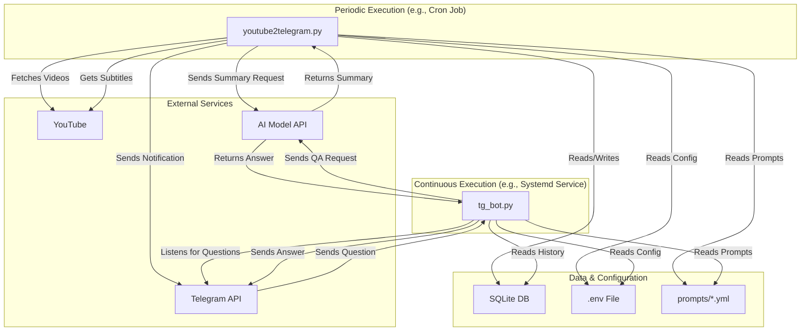

# Project Documentation: yt2telegramRAG

This document provides a comprehensive overview of the `yt2telegramRAG` project, detailing the purpose, functionality, and interaction of each file in the new organized structure.

## 1. Project Overview

`yt2telegramRAG` is a system designed to monitor a YouTube channel, process new videos, and provide summaries and a question-answering interface through a Telegram bot. The "RAG" in the name stands for Retrieval-Augmented Generation, indicating that the system uses retrieved video transcripts and summaries to generate intelligent responses.

The core workflow is as follows:

1.  **Monitor:** A script runs periodically to check for new videos on a specified YouTube channel.
2.  **Process:** For each new video, it downloads the subtitles (transcript).
3.  **Summarize:** The transcript is used to generate a concise summary of the video's content using an AI model.
4.  **Notify:** The summary is sent as a notification to a Telegram chat.
5.  **Store:** The video information, transcript, and summary are stored in a local SQLite database.
6.  **Interact:** A separate Telegram bot script runs continuously, allowing users to ask questions about the videos. It uses the stored transcripts and summaries to generate answers.

## 2. File-by-File Breakdown

### 2.1. Core Application Logic

These files form the main functionality of the project and are organized in the `src/yt2telegram/` directory.

#### `src/yt2telegram/core/youtube2telegram.py`

- **What it does:** This is the main script for monitoring the YouTube channel and processing new videos. It's designed to be run periodically (e.g., via a cron job).
- **How it works:**
  1.  It loads configuration from environment variables (`.env` file).
  2.  It connects to the SQLite database to see which videos have already been processed.
  3.  It uses `yt-dlp` to fetch the latest videos from the specified YouTube channel without needing a YouTube API key.
  4.  For each new video, it calls the `SubtitleExtractor` to get the transcript.
  5.  It then uses the `Summarizer` class (which leverages an AI model like GPT) to create a summary of the video.
  6.  The summary is formatted and sent to the configured Telegram chat via the `Notifier` class.
  7.  Finally, it marks the video as processed in the database, storing the summary and subtitles.
- **Why it exists:** This script automates the entire process of fetching, processing, and notifying about new YouTube content, forming the data-gathering part of the RAG system.

#### `src/yt2telegram/bot/tg_bot.py`

- **What it does:** This script runs a Telegram bot that allows users to ask questions about the content of the YouTube videos.
- **How it works:**
  1.  It loads configuration from the `.env` file, including the Telegram bot token.
  2.  It runs continuously, listening for incoming messages in the Telegram chat.
  3.  When a user sends a question, it queries the SQLite database to retrieve the transcript of the latest video and the summaries of all previously processed videos.
  4.  This retrieved information (the "R" and "A" in RAG) is combined with the user's question and sent to an AI model to generate a relevant answer (the "G" in RAG).
  5.  The generated answer is then sent back to the user in the Telegram chat.
- **Why it exists:** This file provides the interactive, "smart" component of the system, allowing users to query the knowledge base created by `youtube2telegram.py`.

### 2.2. Database Management

#### `src/yt2telegram/db/database.py`

- **What it does:** Handles all database operations for the application.
- **How it works:** Provides a clean interface for saving video information, checking if videos have been processed, and retrieving context for the Telegram bot.
- **Why it exists:** Centralizes database operations and provides a clean separation of concerns between data persistence and business logic.

### 2.3. Utility Scripts

These scripts are focused on getting the raw data from YouTube and are organized in the `src/yt2telegram/utils/` directory.

#### `src/yt2telegram/utils/subtitle_downloader.py`

- **What it does:** A utility script to download subtitles and metadata for a given YouTube video ID using `yt-dlp`.
- **How it works:** It uses the `yt-dlp` command-line tool (via Python's `subprocess` module) to fetch video metadata and download available subtitles. It has logic to prioritize manually created subtitles over auto-generated ones and saves the output to a `downloads` directory. It also extracts a clean, text-only version of the subtitles.
- **Why it exists:** This script provides a robust, `yt-dlp`-based method for subtitle extraction, which can be more reliable than API-based methods. It serves as a standalone tool for testing or manual downloads.

#### `src/yt2telegram/utils/extract_clean_subtitles.py`

- **What it does:** Extracts clean, plain-text subtitles from a YouTube video, without timestamps or formatting.
- **How it works:** This script uses the `youtube-transcript-api` library to fetch subtitles. It has fallback mechanisms to try different subtitle types (manual, auto-generated) if the preferred one is not available.
- **Why it exists:** This provides an alternative, API-based method for subtitle extraction. The main `youtube2telegram.py` script appears to have integrated subtitle extraction directly, but this file remains as a useful utility or a remnant of a previous implementation.

#### `src/yt2telegram/utils/test_subtitles.py`

- **What it does:** A comprehensive testing script to check all available subtitle options for a given YouTube video.
- **How it works:** For a specific video ID, it uses both `yt-dlp` and `youtube-transcript-api` to list and attempt to download all possible subtitle tracks (manual and auto-generated in all available languages). The results are logged and saved to a JSON file.
- **Why it exists:** This is a crucial debugging and development tool. It helps in understanding what subtitles are available for a video and which extraction method works best, which is especially useful when dealing with videos that have inconsistent subtitle availability.

### 2.4. Package Infrastructure

These files define the package structure and make it installable.

#### `src/yt2telegram/__init__.py`

- **What it does:** Marks the directory as a Python package and defines package metadata.
- **How it works:** Contains package version, author, and license information.
- **Why it exists:** Required for Python package structure.

#### `src/yt2telegram/__main__.py`

- **What it does:** Provides a command-line interface for the package.
- **How it works:** Allows running different components of the application through a single entry point.
- **Why it exists:** Makes the package executable and provides a clean interface for running different components.

#### `setup.py` and `pyproject.toml`

- **What they do:** Define the package metadata and dependencies for installation.
- **How they work:** Used by `pip` to install the package and its dependencies.
- **Why they exist:** Enable the project to be installed as a proper Python package.

### 2.5. Configuration and Documentation

These files define the project's configuration, explain its usage, and document its components.

#### `requirements.txt`

- **What it does:** Lists all the Python libraries and dependencies required to run the project.
- **How it works:** This file is used by `pip` (Python's package installer) to install everything needed with a single command (`pip install -r requirements.txt`).
- **Why it exists:** To ensure that the project can be set up easily and reliably in any environment.

#### `requirements-dev.txt`

- **What it does:** Lists development dependencies for linting, testing, and formatting.
- **How it works:** Used by developers to set up a complete development environment.
- **Why it exists:** Separates development tools from runtime dependencies.

#### `.env.example`

- **What it does:** An example configuration file.
- **How it works:** Users are meant to copy this file to `.env` and fill in their own secret keys and configuration values (like API keys, channel IDs, etc.). The application code then loads these values from the `.env` file.
- **Why it exists:** To provide a clear template for all required configuration and to avoid committing sensitive information directly into the source code.

#### `README.md`

- **What it does:** The main documentation file for the project.
- **How it works:** It's a Markdown file that explains what the project is, its features, how to set it up, and how to use the different scripts.
- **Why it exists:** To be the primary source of information for anyone new to the project.

## 3. Logical Flow and Connections

The diagram below illustrates how the components interact:



**Key Interactions:**

- **`youtube2telegram.py` (The Collector):** Acts as the data pipeline. It's the only component that writes new video data to the `SQLite DB`. It reads configuration from `.env` and prompts from `.yml` files to interact with `YouTube`, the `AI Model API`, and `Telegram`.
- **`tg_bot.py` (The Interlocutor):** Acts as the user interface. It _reads_ from the `SQLite DB` to provide context for its answers. It communicates with the user via the `Telegram API` and generates answers using the `AI Model API`.
- **`SQLite DB` (The Memory):** This is the central state of the application. It decouples the collector from the interlocutor, allowing the bot to have access to a persistent history of all processed videos, even if it's restarted.
- **`.env` and `prompts/*.yml` (The Brain):** These files contain the configuration and core instructions (prompts) for the AI, allowing for easy modification of the system's behavior without changing the code.
- **Utility Scripts (`test_subtitles.py`, etc.):** These are supporting tools that don't run as part of the main application flow but are used for development, debugging, and manual data extraction.

This structure creates a robust and modular system where the data collection and user interaction components are separate, communicating only through the shared database.

## 4. Usage Examples

After installing the package with `pip install -e .`:

```bash
# Monitor for new videos
yt2telegram monitor

# Run the Telegram bot
yt2telegram bot

# Download subtitles for a specific video
yt2telegram download-subtitles --video-id VIDEO_ID

# Test subtitle extraction for a specific video
yt2telegram test-subtitles --video-id VIDEO_ID

# Extract clean subtitles for a specific video
yt2telegram extract-subtitles --video-id VIDEO_ID
```

Or directly with Python:

```bash
# Monitor for new videos
python -m src.yt2telegram.core.youtube2telegram

# Run the Telegram bot
python -m src.yt2telegram.bot.tg_bot

# Download subtitles for a specific video
python -m src.yt2telegram.utils.subtitle_downloader VIDEO_ID

# Test subtitle extraction for a specific video
python -m src.yt2telegram.utils.test_subtitles VIDEO_ID

# Extract clean subtitles for a specific video
python -m src.yt2telegram.utils.extract_clean_subtitles VIDEO_ID
```
